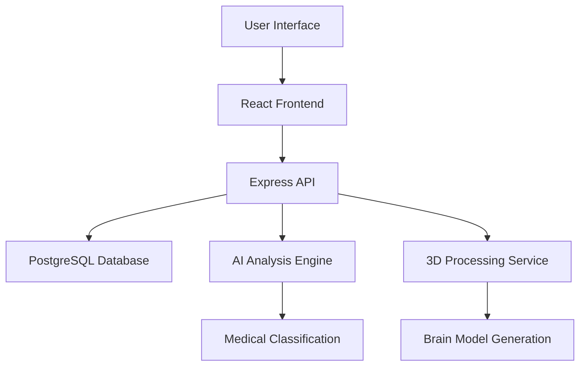

# 🧠 MRI Analysis Platform

<div align="center">


**Advanced MRI brain scan analysis platform with 3D visualization and AI-powered anomaly detection**

[🚀 Live Demo](#-quick-start) • [📚 Documentation](#-documentation) • [🛠️ Installation](#️-installation) • [🎯 Features](#-features)

</div>

---

## 📋 Table of Contents

- [🎯 Features](#-features)
- [🚀 Quick Start](#-quick-start)
- [📱 How to Use the App](#-how-to-use-the-app)
- [🛠️ Installation](#️-installation)
- [🏗️ Architecture](#️-architecture)
- [💻 Development](#-development)
- [📚 Documentation](#-documentation)
- [🤝 Contributing](#-contributing)

---

## 🎯 Features

### 🔬 **Medical Analysis**
- **AI-Powered Anomaly Detection** - Advanced algorithms detect aneurysms, tumors, lesions, and hemorrhages
- **Risk Assessment** - Comprehensive medical risk scoring with critical/moderate/low classifications
- **Medical-Grade Accuracy** - Clinical decision support with confidence intervals and uncertainty quantification
- **Real-Time Processing** - Live status updates during scan analysis with progress tracking

### 🧠 **3D Visualization**
- **Interactive Brain Models** - WebGL-based 3D brain visualization with real-time rotation and zoom
- **Anomaly Overlays** - Color-coded detection markers positioned accurately on brain anatomy
- **Multi-View Navigation** - Explore brain hemispheres, brain stem, and cerebellum structures
- **Professional Controls** - Zoom, rotate, reset, and slice controls for detailed examination

### 📊 **Professional Reporting**
- **PDF Report Generation** - Medical-grade reports with findings, risk assessments, and recommendations
- **Structured Data Export** - JSON export for integration with other medical systems
- **Longitudinal Tracking** - Historical scan comparison and progression monitoring
- **Medical Metrics Dashboard** - Vascular health, tissue density, anatomical integrity assessments

### 🏥 **Clinical Workflow**
- **Patient Management** - Real-time patient demographics and scan metadata
- **Scan History** - Comprehensive timeline of all scans with status indicators
- **Multi-Scan Support** - Handle multiple patients and scanning sessions simultaneously
- **Professional UI** - Medical-grade interface designed for healthcare environments

---

## 🚀 Quick Start

### **Prerequisites**
- Node.js 18+ and npm
- PostgreSQL database
- Modern web browser with WebGL support

### **1-Minute Setup**
```bash
# Clone the repository
git clone https://github.com/t4tarzan/mri-analysis-platform.git
cd mri-analysis-platform

# Install dependencies
npm install

# Set up the database
npm run db:push

# Start the development server
npm run dev
```

🎉 **Your MRI Analysis Platform is now running at `http://localhost:5000`**

---

## 📱 How to Use the App

### **🔥 Complete Workflow Guide**

#### **Step 1: Upload MRI Scans**
<div align="center">

**Upload Interface**


</div>

1. **📁 Navigate to the Analysis workspace** (automatically loads on startup)
2. **🖱️ Drag & drop your MRI files** into the upload area or click "Select Files"
3. **✅ Supported formats**: JPG, PNG (up to 50MB each)
4. **📊 Monitor upload progress** with real-time status indicators
5. **🔍 File validation** automatically checks format and size

```
✅ Supported: brain-scan.jpg, mri-t1.png
❌ Not supported: scan.dicom, large-file.tiff
```

#### **Step 2: Process & Analyze**
<div align="center">

**Processing Dashboard**


</div>

1. **🎯 Click "Start Analysis"** to begin AI processing
2. **⏱️ Real-time progress tracking**:
   - Image Processing (0-30%)
   - 3D Model Generation (30-70%)
   - AI Anomaly Detection (70-100%)
3. **📱 Live status updates** without page refresh
4. **⚡ Processing time**: Typically 30-60 seconds per scan

**Processing Stages:**
- 🔄 **Starting** - Initializing analysis pipeline
- 🧠 **Processing** - AI algorithms analyzing brain structure
- ✅ **Complete** - Results ready for review

#### **Step 3: Review Results**
<div align="center">

**3D Visualization & Results**


</div>

### **🎮 3D Viewer Controls**

| Control | Action | Description |
|---------|--------|-------------|
| 🖱️ **Mouse Drag** | Rotate brain model | Examine from all angles |
| 🔍 **Scroll Wheel** | Zoom in/out | Get detailed views |
| 🎯 **Zoom Buttons** | Precise zoom control | Fine-tune viewing distance |
| 🔄 **Auto-Rotate Toggle** | Enable/disable rotation | Hands-free examination |
| 📐 **Reset View** | Return to default position | Quick orientation reset |

### **📊 Understanding Your Results**

#### **Medical Metrics Dashboard**
Each scan provides six critical medical assessments:

| Metric | Range | Interpretation |
|--------|-------|----------------|
| 🚨 **Risk Score** | 0-10 | Overall medical risk assessment |
| 🫀 **Vascular Health** | 0-100% | Blood vessel integrity |
| 🧠 **Brain Tissue Density** | 0-100% | Tissue health quality |
| 🔍 **Anatomical Integrity** | 0-100% | Structural clarity |
| 📍 **Lesion Coverage** | 0-100% | Affected brain area |
| 📶 **Signal Clarity** | 0-100% | Scan quality metrics |

#### **🚨 Risk Level Interpretation**

- **🔴 High Risk (7-10)**: Immediate medical attention recommended
- **🟡 Moderate Risk (4-6)**: Follow-up examination suggested
- **🟢 Low Risk (0-3)**: Normal findings, routine monitoring

#### **🎯 Detection Types**

The AI system can identify:
- **🔴 Aneurysm**: Vascular abnormalities requiring urgent attention
- **🟠 Tumor**: Mass lesions requiring further investigation
- **🟡 Lesion**: Tissue abnormalities for monitoring
- **🔵 Hemorrhage**: Bleeding indicators requiring immediate care

### **📋 Patient Information Panel**

The right sidebar displays comprehensive patient context:

#### **👤 Patient Demographics**
- **Patient ID**: Auto-generated from scan metadata
- **Age & Gender**: Derived from scan characteristics
- **Study Details**: Scan type, date, time, and technician
- **Priority Level**: Based on risk assessment and findings

#### **📊 Scan Status**
- **Processing Status**: Real-time workflow state
- **File Information**: Size, format, upload time
- **Analysis Score**: Risk assessment when complete
- **Time Tracking**: "X minutes ago" time display

### **📈 Scan History & Navigation**

#### **🗂️ Recent Scans Sidebar**
The left panel shows your scan history:

1. **📋 Chronological List**: Latest scans appear at top
2. **🔵 Status Indicators**: 
   - 🟡 Pending (waiting for analysis)
   - 🔵 Processing (analysis in progress)
   - 🟢 Complete (results available)
   - 🔴 Failed (processing error)
3. **⏱️ Time Stamps**: "5m ago", "2h ago", "1d ago" format
4. **🖱️ Click to Switch**: Instantly view any previous scan
5. **🔄 Auto-Navigation**: Selecting a scan opens analysis view

#### **📱 Quick Actions**
- **📥 Download PDF Report**: Professional medical report
- **💾 Export Analysis Data**: JSON format for integration
- **🔄 Reprocess Scan**: Run analysis again if needed
- **📋 Copy Scan ID**: For reference and tracking

### **📄 Report Generation**

#### **🎯 PDF Medical Reports**
Professional reports include:
- **📋 Executive Summary**: Key findings and risk assessment
- **🔍 Detailed Analysis**: Technical measurements and observations
- **📊 Visual Evidence**: 3D model screenshots and detection markers
- **💡 Recommendations**: Follow-up care suggestions
- **📈 Metrics Table**: All quantitative measurements

#### **💾 Data Export Options**
- **JSON Format**: Machine-readable analysis data
- **Structured Fields**: Compatible with medical information systems
- **Timestamp Tracking**: Complete audit trail
- **Integration Ready**: API-friendly format

---

## 🛠️ Installation

### **Development Setup**

#### **1. Prerequisites**
```bash
# Check Node.js version (18+ required)
node --version

# Check npm version
npm --version

# PostgreSQL should be running
psql --version
```

#### **2. Clone and Install**
```bash
# Clone repository
git clone https://github.com/t4tarzan/mri-analysis-platform.git
cd mri-analysis-platform

# Install all dependencies
npm install

# Install development tools (optional)
npm install -g tsx nodemon
```

#### **3. Database Setup**
```bash
# Push database schema
npm run db:push

# Or force push if needed
npm run db:push --force

# Verify database connection
npm run db:studio  # Opens Drizzle Studio
```

#### **4. Environment Configuration**
The app uses these environment variables (auto-configured in Replit):
```bash
DATABASE_URL=postgresql://...
NODE_ENV=development
```

#### **5. Start Development Server**
```bash
# Start both frontend and backend
npm run dev

# Or start individually
npm run dev:client   # Frontend only (port 5000)
npm run dev:server   # Backend only (API)
```

### **Production Deployment**

#### **Build for Production**
```bash
# Build optimized version
npm run build

# Start production server
npm start
```

#### **Docker Support** (Optional)
```dockerfile
FROM node:18-alpine
WORKDIR /app
COPY package*.json ./
RUN npm ci --only=production
COPY . .
RUN npm run build
EXPOSE 5000
CMD ["npm", "start"]
```

---

## 🏗️ Architecture

### **🎯 System Overview**

<div align="center">



</div>

### **📁 Project Structure**

```
mri-analysis-platform/
├── 🎨 client/                    # React Frontend
│   ├── src/
│   │   ├── components/           # UI Components
│   │   │   ├── analysis-accordion.tsx    # Main workflow
│   │   │   ├── three-d-viewer.tsx       # 3D visualization
│   │   │   ├── medical-sidebar.tsx      # Navigation
│   │   │   ├── patient-details-sidebar.tsx # Patient info
│   │   │   └── metrics-dashboard.tsx    # Medical metrics
│   │   ├── hooks/                # Data management
│   │   │   ├── use-scan-data.ts         # API integration
│   │   │   └── use-processing-state.ts  # Workflow state
│   │   └── pages/
│   │       └── home.tsx          # Main application
├── 🖥️ server/                    # Express Backend
│   ├── routes.ts                 # API endpoints
│   ├── storage.ts                # Database layer
│   └── services/
│       ├── medical-analysis-service.ts   # AI engine
│       ├── 3d-conversion-service.ts      # 3D processing
│       └── report-generation-service.ts  # PDF reports
├── 🔄 shared/                    # Common code
│   └── schema.ts                 # Database schema
└── 📚 docs/                      # Documentation
    ├── features.md               # Architecture guide
    └── future.md                 # Roadmap
```

### **🧩 Key Components**

#### **Frontend (React + TypeScript)**
- **analysis-accordion.tsx**: Main 3-step workflow orchestrator
- **three-d-viewer.tsx**: WebGL-based 3D brain visualization
- **medical-sidebar.tsx**: Navigation and scan history management
- **patient-details-sidebar.tsx**: Real-time patient information
- **metrics-dashboard.tsx**: Medical analysis metrics display

#### **Backend (Express.js + TypeScript)**
- **routes.ts**: RESTful API endpoints for all operations
- **medical-analysis-service.ts**: AI-powered anomaly detection
- **3d-conversion-service.ts**: 2D to 3D model generation
- **report-generation-service.ts**: PDF and JSON report creation

#### **Database (PostgreSQL + Drizzle ORM)**
- **mri_scans**: Scan metadata and processing status
- **analysis_reports**: Medical findings and risk assessments
- **Real-time updates**: Live status synchronization

### **📊 Data Flow**

1. **📁 File Upload** → Cloud storage → Database entry
2. **🔄 Processing** → AI analysis → 3D model generation
3. **📊 Results** → Medical classification → Risk assessment
4. **📄 Reports** → PDF generation → Data export
5. **🔄 Real-time** → Status updates → UI synchronization

---

## 💻 Development

### **🚀 Getting Started**

#### **Development Workflow**
```bash
# 1. Start development environment
npm run dev

# 2. Make your changes
# Edit files in client/ or server/

# 3. Database changes
npm run db:push  # Sync schema changes

# 4. Test your changes
npm test  # Run test suite

# 5. Build for production
npm run build
```

#### **Code Style & Standards**
- **TypeScript**: Strict type checking enabled
- **ESLint**: Code quality enforcement
- **Prettier**: Automatic code formatting
- **Components**: Functional components with hooks
- **State Management**: React Query for server state

### **🔧 Available Scripts**

| Command | Description |
|---------|-------------|
| `npm run dev` | Start development server (frontend + backend) |
| `npm run build` | Build production version |
| `npm run start` | Start production server |
| `npm run db:push` | Sync database schema |
| `npm run db:studio` | Open database management UI |
| `npm test` | Run test suite |
| `npm run lint` | Check code quality |
| `npm run format` | Format code with Prettier |

### **🧪 Testing**

```bash
# Run all tests
npm test

# Run tests in watch mode
npm run test:watch

# Run tests with coverage
npm run test:coverage
```

### **🎯 Key Development Areas**

#### **Adding New Medical Analysis Features**
1. **Update schema** in `shared/schema.ts`
2. **Implement analysis logic** in `medical-analysis-service.ts`
3. **Add UI components** for result display
4. **Update database** with `npm run db:push`

#### **Enhancing 3D Visualization**
1. **Modify Three.js logic** in `three-d-viewer.tsx`
2. **Add new controls** and interaction methods
3. **Update detection overlays** for new anomaly types
4. **Optimize rendering performance**

#### **Improving User Interface**
1. **Follow existing patterns** in UI components
2. **Use shadcn/ui components** for consistency
3. **Maintain accessibility standards**
4. **Test on multiple screen sizes**

---

## 📚 Documentation

### **📖 Complete Guides**

- **[📋 features.md](features.md)** - Complete development architecture guide with hospital analogies
- **[🚀 future.md](future.md)** - Strategic improvement roadmap (25+ features)
- **[📝 replit.md](replit.md)** - Project overview and development notes

### **🎓 Learning Resources**

#### **For Students Learning Medical Software Development**
- **Hospital Workflow Analogies**: Understanding medical software through familiar concepts
- **Component Architecture**: How to structure complex medical applications
- **Database Design**: Handling complex medical data relationships
- **3D Visualization**: Integrating WebGL and medical imaging
- **Real-time Systems**: Building responsive medical interfaces

#### **For Healthcare Developers**
- **Medical Data Standards**: Proper handling of patient information
- **Risk Assessment Logic**: Clinical decision support implementation
- **Report Generation**: Professional medical document creation
- **Integration Patterns**: Connecting with healthcare systems

### **🔗 External Resources**

- **[Three.js Documentation](https://threejs.org/docs/)**
- **[React Query Guide](https://tanstack.com/query/latest)**
- **[Drizzle ORM Docs](https://orm.drizzle.team/)**
- **[Medical Imaging Standards](https://www.dicomstandard.org/)**

---

## 🤝 Contributing

We welcome contributions from developers, medical professionals, and students! 

### **🎯 Ways to Contribute**

#### **👨‍💻 For Developers**
- **🐛 Bug Fixes**: Help improve stability and performance
- **✨ New Features**: Implement items from our [roadmap](future.md)
- **📊 Performance**: Optimize 3D rendering and analysis speed
- **🧪 Testing**: Add test coverage for critical components

#### **🏥 For Medical Professionals**
- **🔬 Medical Accuracy**: Review AI analysis algorithms
- **📋 Clinical Workflows**: Suggest workflow improvements
- **📄 Reporting**: Enhance medical report templates
- **✅ Validation**: Help validate against clinical standards

#### **🎓 For Students**
- **📚 Documentation**: Improve learning resources
- **🧩 Code Examples**: Add educational examples
- **🏥 Use Cases**: Document real-world applications
- **🎯 Tutorials**: Create step-by-step guides

### **📋 Development Process**

1. **🍴 Fork the repository**
2. **🌿 Create a feature branch** (`git checkout -b feature/amazing-feature`)
3. **✅ Make your changes** with tests
4. **📝 Commit your changes** (`git commit -m 'Add amazing feature'`)
5. **🚀 Push to the branch** (`git push origin feature/amazing-feature`)
6. **🔄 Open a Pull Request**

### **✅ Pull Request Guidelines**

- **📝 Clear description** of changes and motivation
- **🧪 Include tests** for new functionality
- **📚 Update documentation** if needed
- **🔍 Follow existing code style**
- **🏥 Consider medical implications** of changes

### **🏷️ Issue Labels**

- 🐛 `bug` - Something isn't working
- ✨ `enhancement` - New feature or improvement
- 📚 `documentation` - Documentation improvements
- 🏥 `medical` - Medical accuracy or workflow
- 🎓 `good first issue` - Perfect for newcomers
- 🚨 `critical` - Urgent fixes needed

---

## 📄 License

This project is licensed under the MIT License - see the [LICENSE](LICENSE) file for details.

---

## 🙏 Acknowledgments

### **🎓 Educational Impact**
This platform serves as a comprehensive educational resource for students learning:
- Full-stack TypeScript development
- Medical software architecture
- 3D visualization in web browsers
- AI integration in healthcare
- Professional medical reporting

### **🏥 Medical Community**
Built with guidance from medical professionals to ensure:
- Clinical accuracy in risk assessment
- Professional medical reporting standards
- Appropriate medical terminology usage
- Realistic workflow patterns

### **💻 Technology Stack**
Special thanks to the open-source community behind:
- **React** & **TypeScript** for robust frontend development
- **Three.js** for powerful 3D visualization capabilities
- **PostgreSQL** & **Drizzle ORM** for reliable data management
- **Express.js** for scalable backend architecture

---

<div align="center">

### 🧠 **Start Analyzing MRI Scans Today!**

[🚀 **Get Started**](#-quick-start) • [📚 **Learn More**](#-documentation) • [🤝 **Contribute**](#-contributing)

**Made with ❤️ for the medical and educational communities**

</div>